# What are action sequences

Action Sequence is a list of actions that can be used for interactivity in the game.

**Sequence:** A list of things (like number, events, actions) arranged in a specific order.

Here's a preview of what we're going to make.

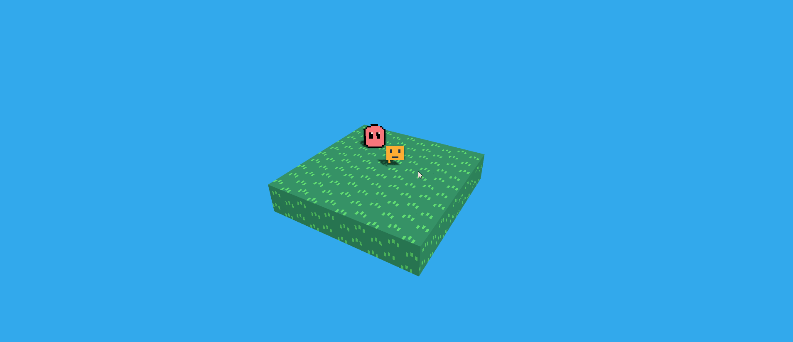

## Create an action

For example, let us make it so we can talk to our creature.

Go to the "Action Sequences" tab and click "New" button.

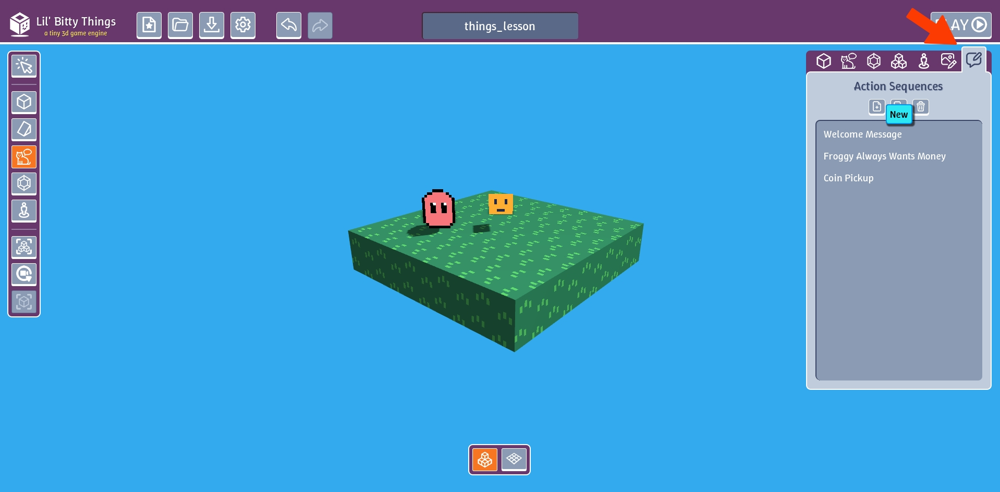

In the action sequence editor, name our action "Hello World".

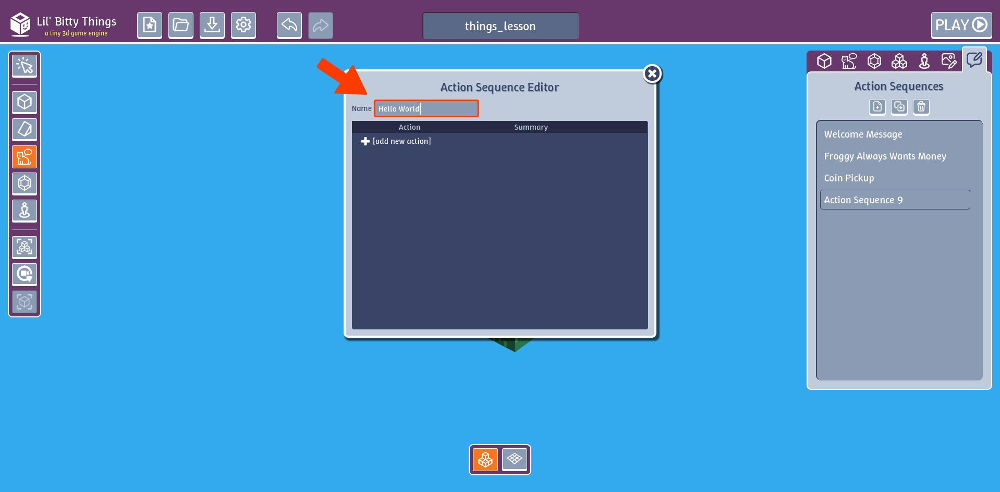

If you click our action a button will show up on the button

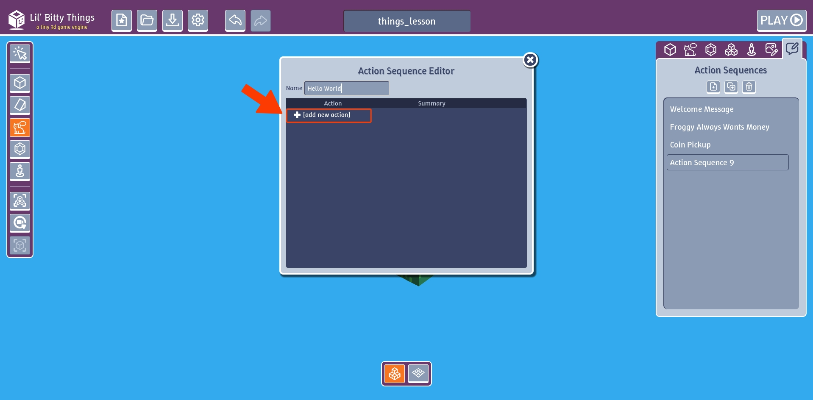

This button is a drop down menu with a list of possible actions we can add to our sequence

If you click on it you can see all the possible action you can add.

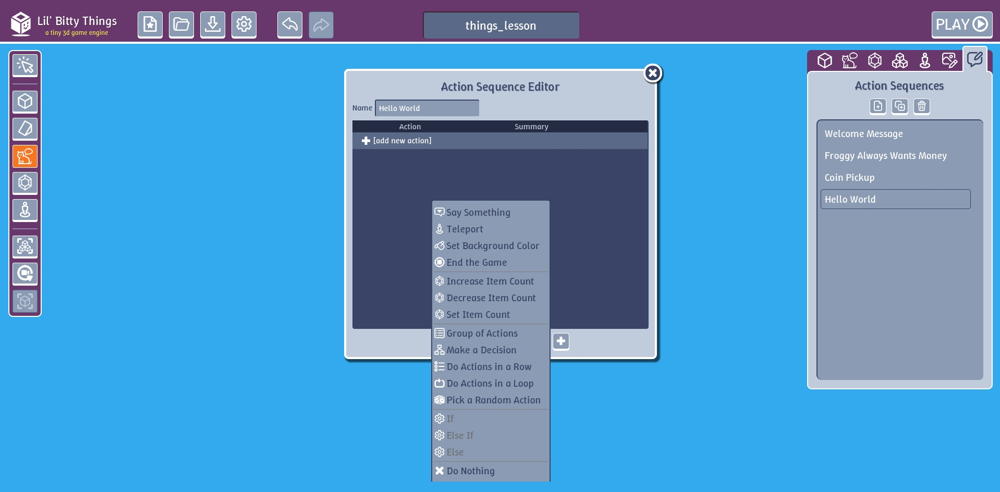

The particular action we are interested in is called the "Say Something" action. This makes it so
when we walk up and touch a Thing, it will say whatever we want.

Click on the "Say Something" action

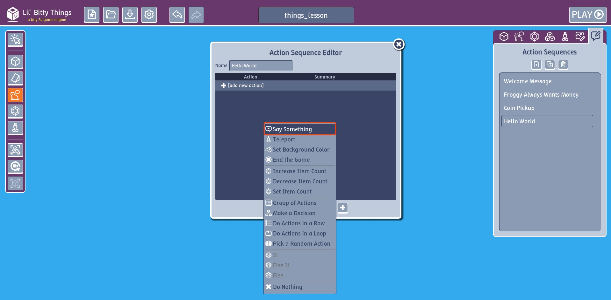

Click the add action "+" button.

In the textbox, type in "Hello wonderful World!".

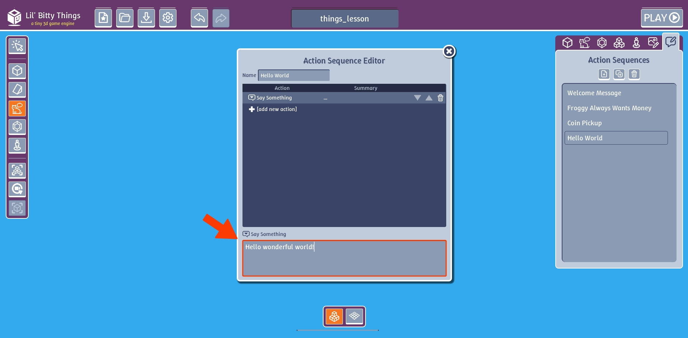

## Add action to a Thing

Close the Action Sequence Editor and go to the "Things" tab. Click on our creature and look for the drop
button in the "Action Sequence" section.

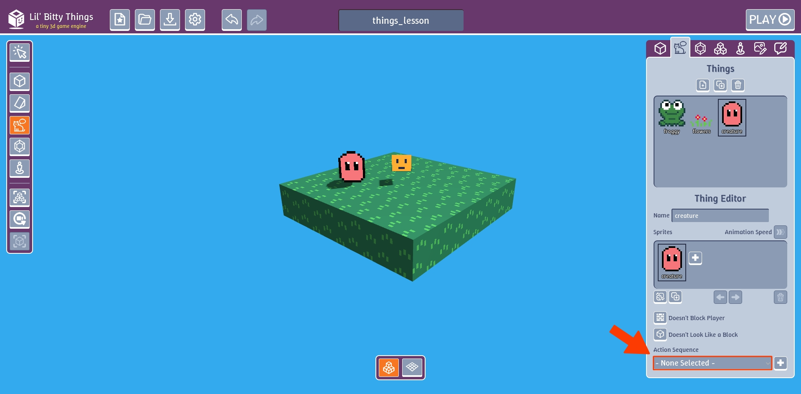

If you click on the drop down button you will see that our "Hello World" action shows up on the bottom

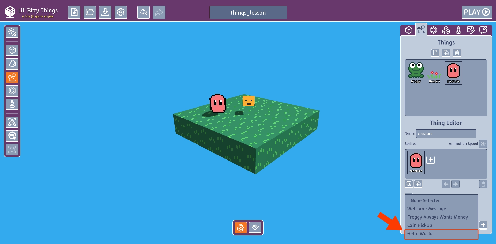

Click on the "Hello World" action

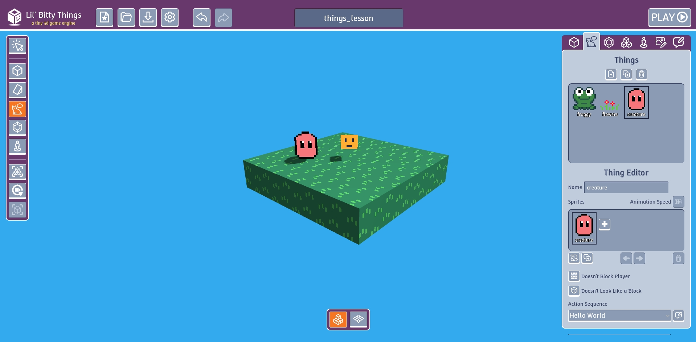

# Test our action

Click play if you walk up to the creature a black rectangle with text should show up.
This is called a dialogue box.

**Dialogue Box:** A temporary pop-up window in a user interface that displays text which you need to click a button or key
to continue.

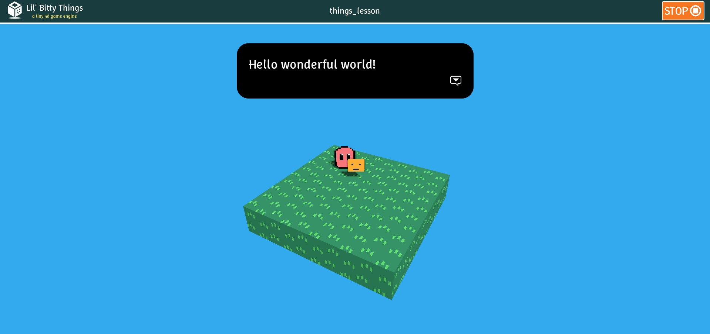

# Edit action

We can add multiple actions to our list of actions and then the game will perform each
action in the order from top to bottom.

Go back to the "Action Sequence" tab and click on the "Hello World" action sequence. The 
editor will popup.

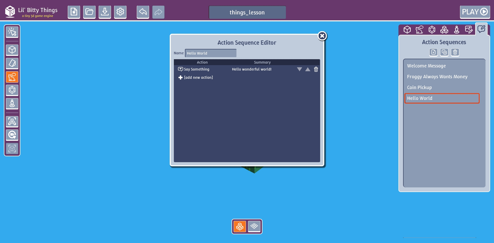

Click on "[add new action]"

In the drop down menu button, "Say Something" action is already selected. So click the plus "+"
button to add another "Say Something" action to our action sequence.

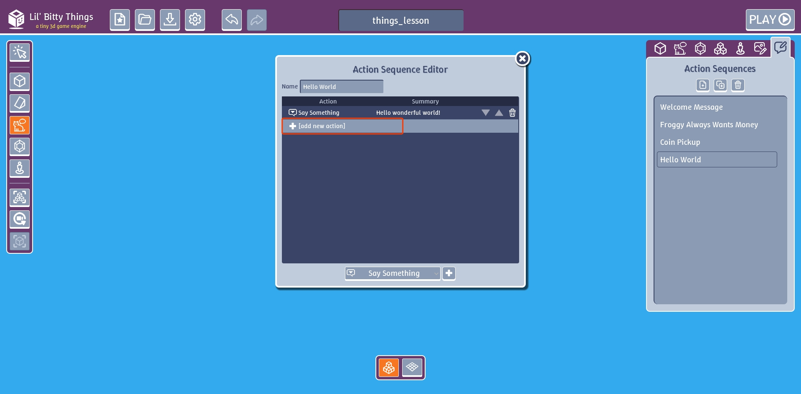

Type in something into the text box

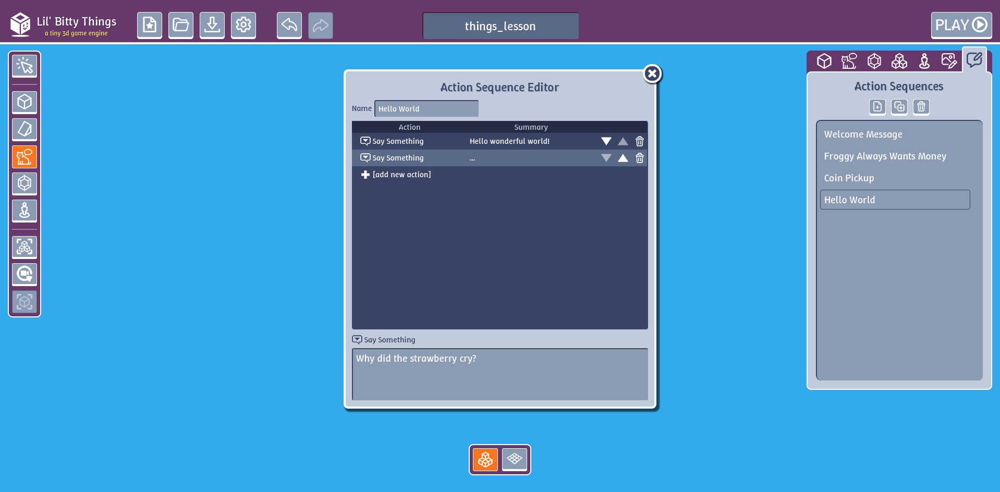

Add one more action and enter some text.

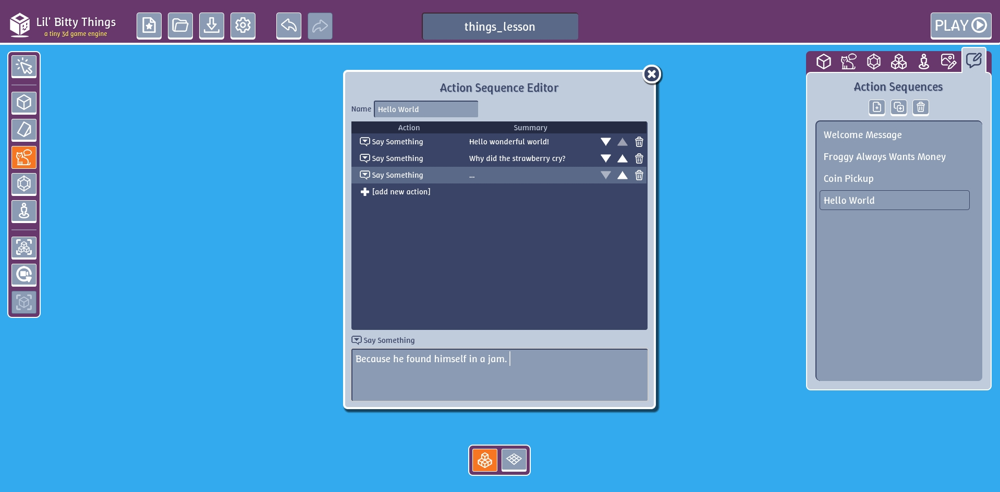

Here's the final result.

