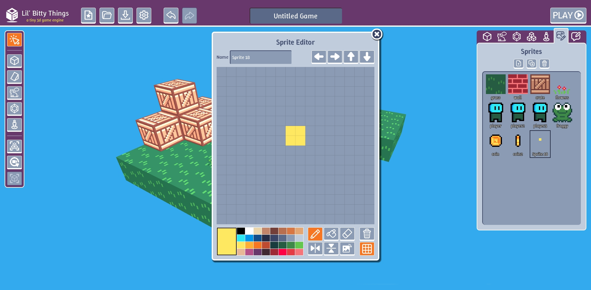
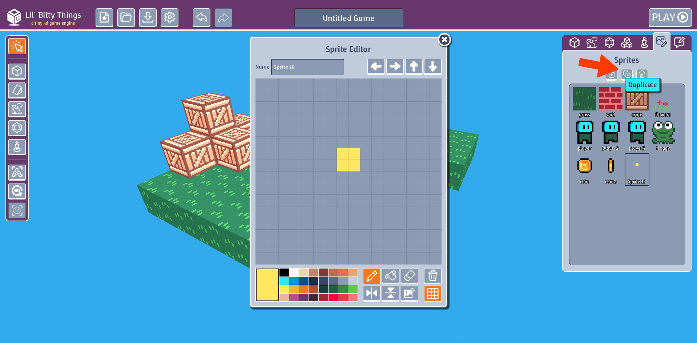
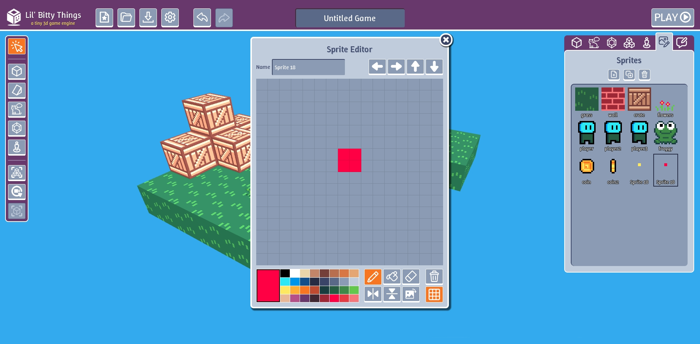
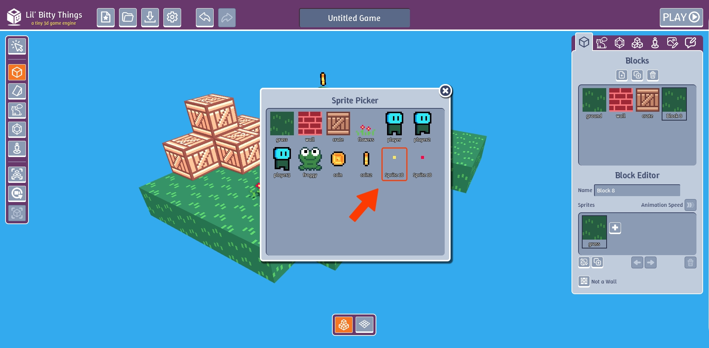
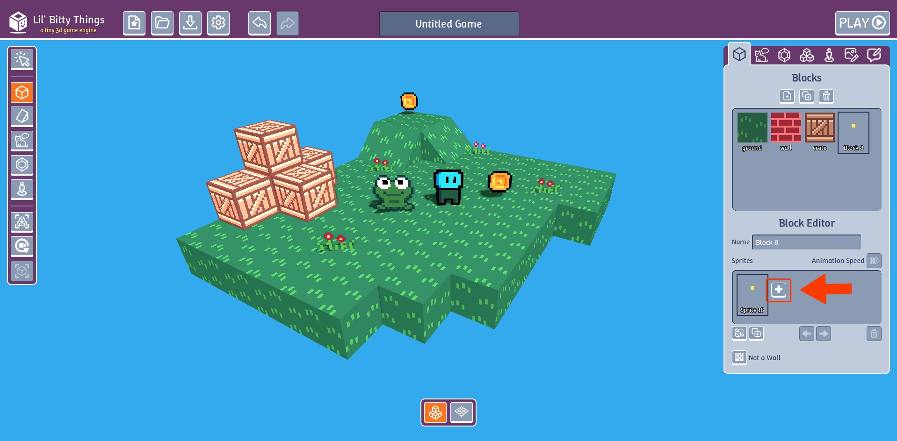
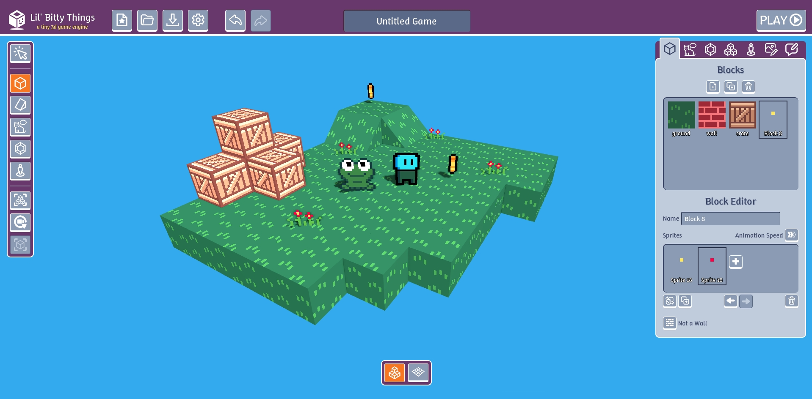
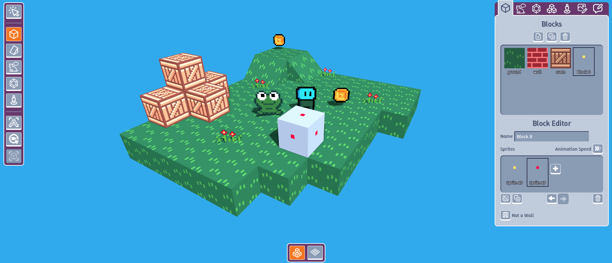
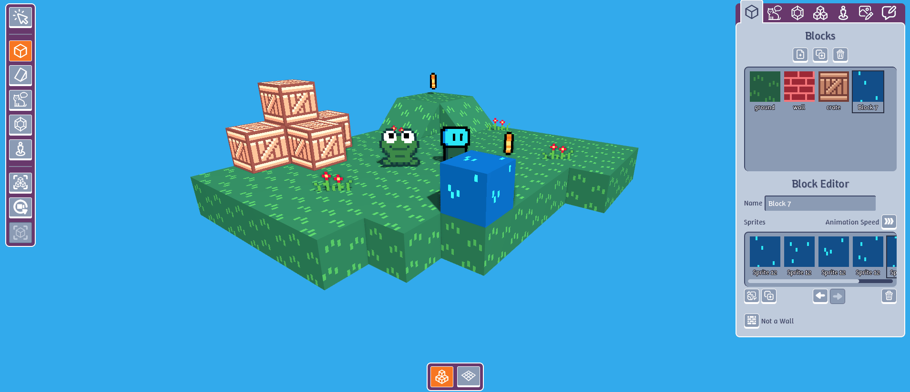

Not only can blocks have a custom sprite, they can have a multiple sprites that repeat in a loop to create an animation.

# Create an animation

First lets create several sprites that we can loop.

Go to the "Sprites" tab and click "New". In the editor draw square.

Click on the "Duplicate" button to create a new copy the sprite we just made.

Draw over our square with a different color.

Go to the "Blocks" tab and click the plus "+" button in the "Sprites" section.

In the "Sprites" section of the "Blocks" tab click "Replace Sprite" button. Select the first sprite we made.

Click on the plus "+" to add our second sprite

This is what our "Sprites" section should look like

And if you place the block in the scene it should look like this.

You don't have to limit yourself to 2 sprites. In this animation I'm using 5 sprites.

