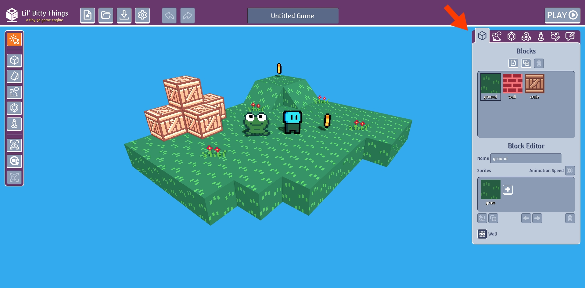
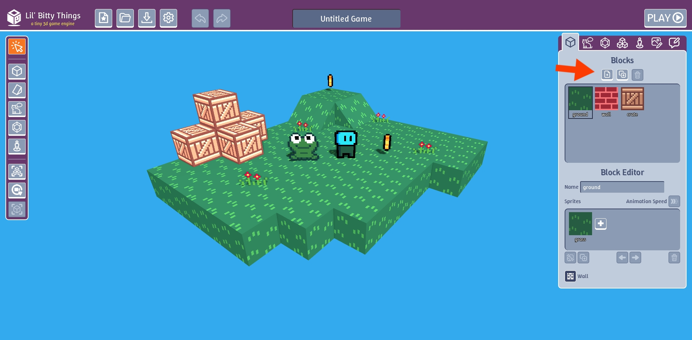
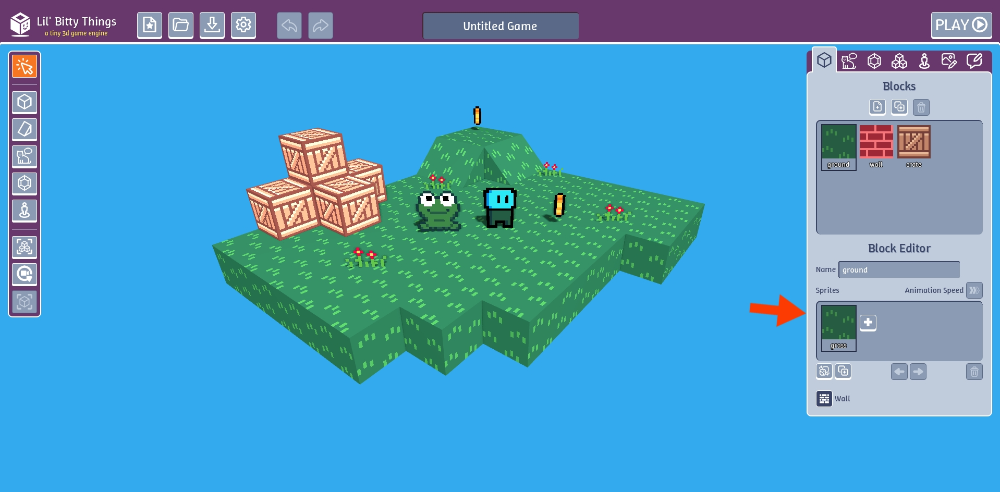
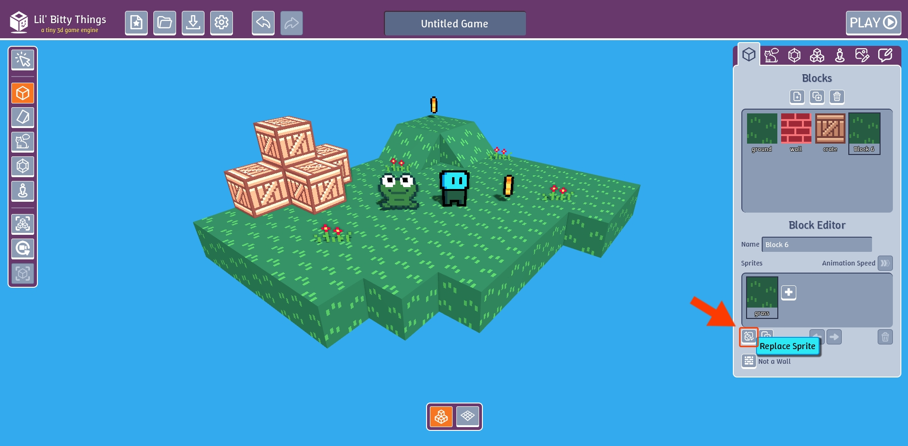
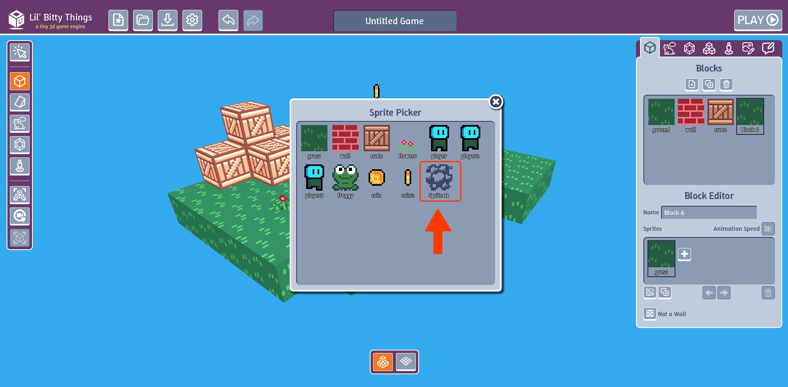
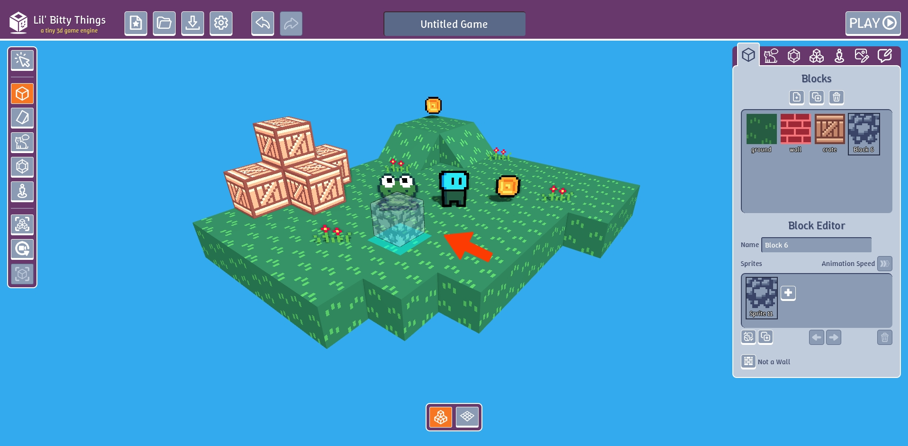
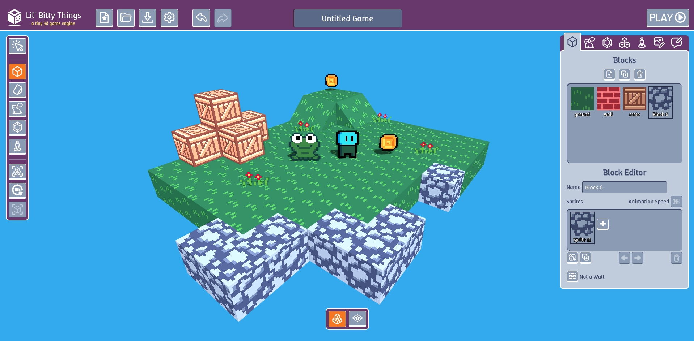

# Create a Block

Click on the "Blocks" tab.

Click "New".

In the "Sprites" section, click on the grass sprite.

Click replace sprite button

This will pop up a list of all our sprites. Click the new sprite we made

Click "Add Blocks" or "Add Slopes" modes. You click should now be able to see block
under the mouse cursor is using our new block with the custom sprite.

