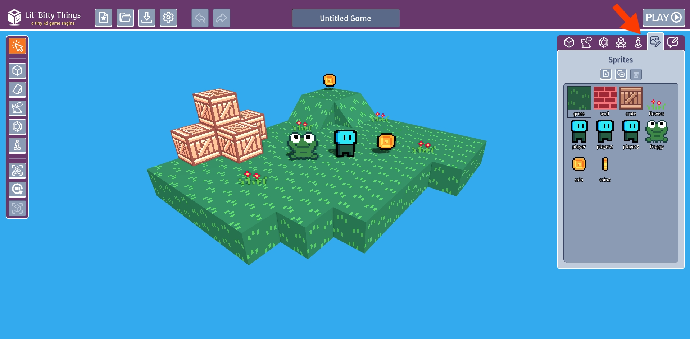
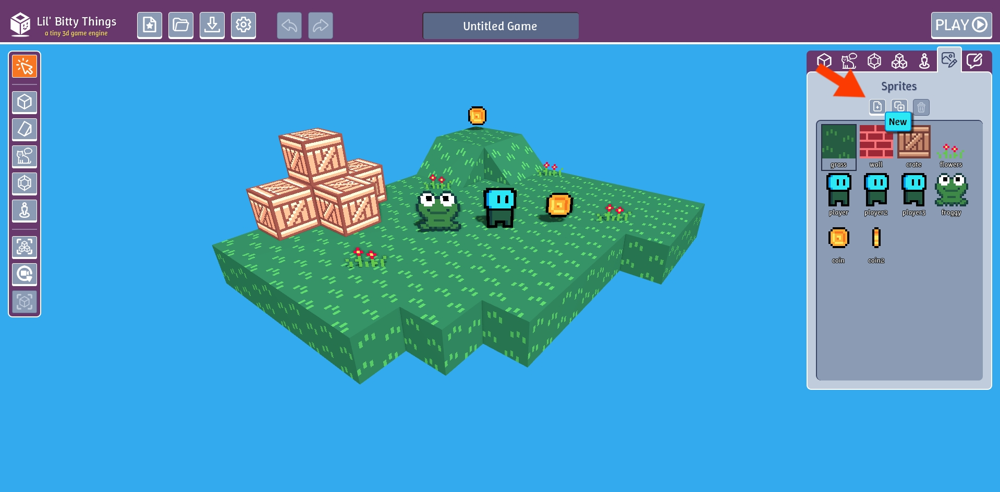
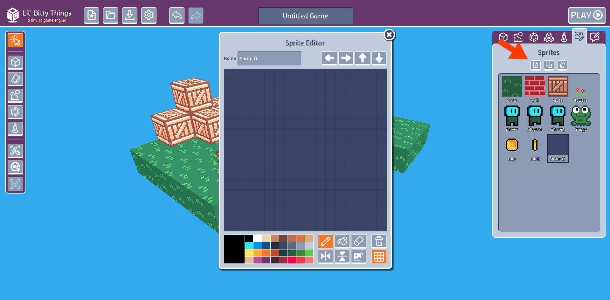
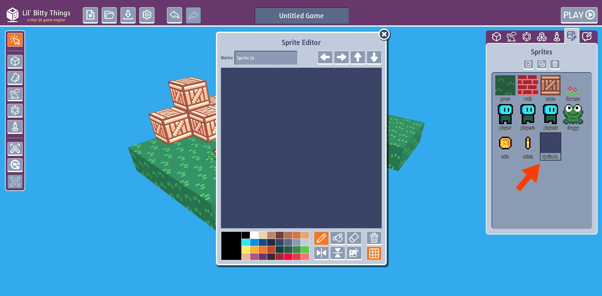
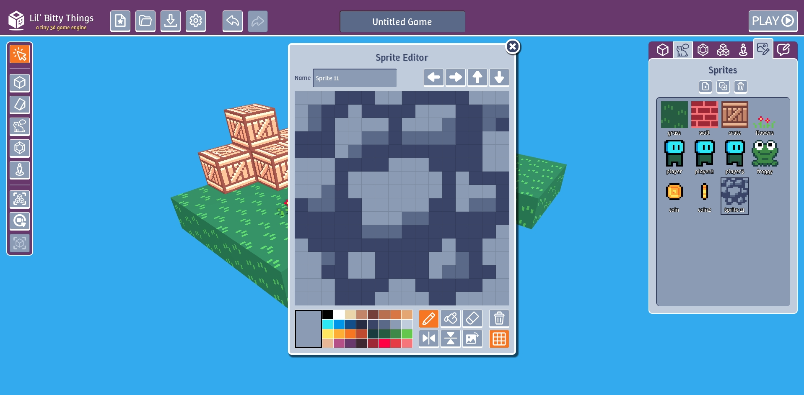

What if we wanted a block that had a different material like stone or ice. In Lil Bitty Things sprites are 2d images
that go onto blocks and other game objects like digital stickers.

# Create a sprite

Go to the "Sprites" tab.

Click "New" button.

The sprite editor will automatically pop up for drawing images.

If the editor doesn't open or if the editor accidently gets closed, you can open the 
editor by simply left clicking on the sprite in the "Sprites" tab. 

Draw an image in the sprite editor. Notice as you draw the icon in the "Sprites" tab automatically updates.

# What's next?

But how do we use our sprite in our game? In the next section we'll learn how to create a custom block
that uses our sprite.