# What are Items?
Items are stuff that you pick up. Visually they look just like Things, but when the Player walks over an Item, it gets picked up and added to the Player’s inventory. Like the Player and Things, Items always face the camera. You can have as many copies of an Item in the game as you want.

In this lesson we're going to learn how to feed our creature a cookie.

## Create an item

For this this lesson I've provided a premade level to save some time.

<a href="/lil-bitty-things-tour/items-lesson-start.txt" download>Click me to download items lesson starting setup</a>

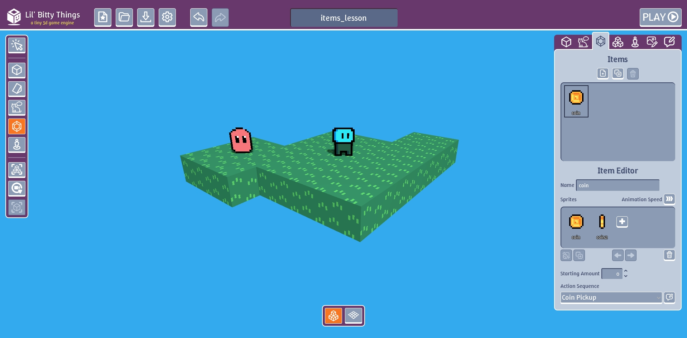

Go to the "Sprites" tab and create a new Sprite.

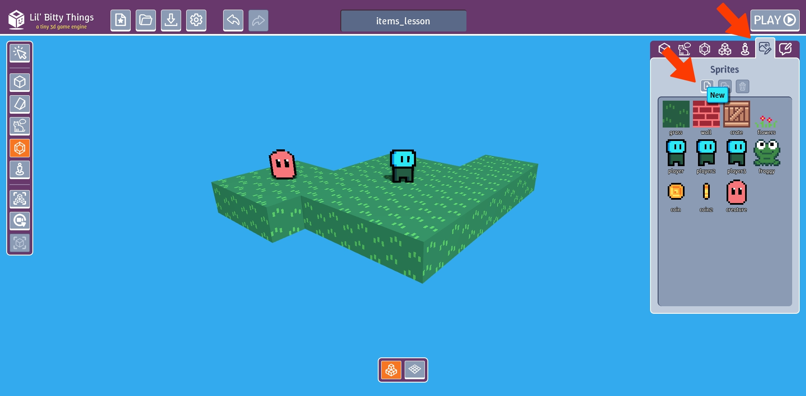

Draw a cookie or food of your choice.

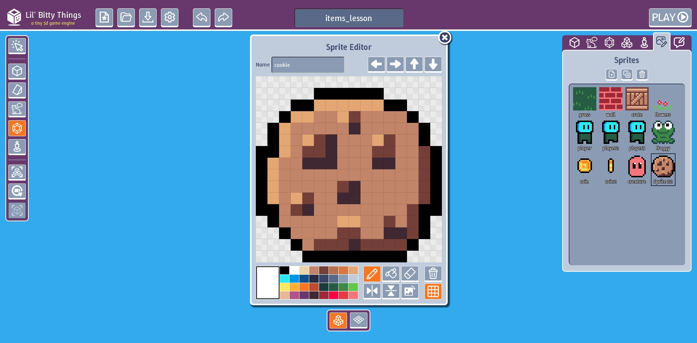

Go to the "Items" tab and create a new Item.

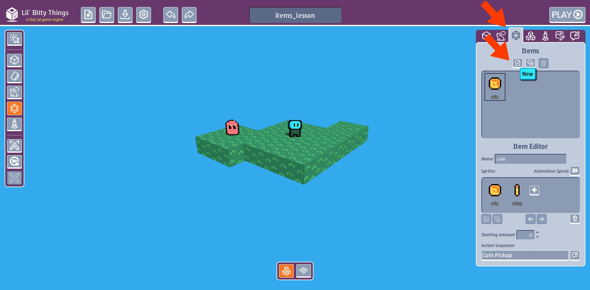

Replace the new Item sprite.

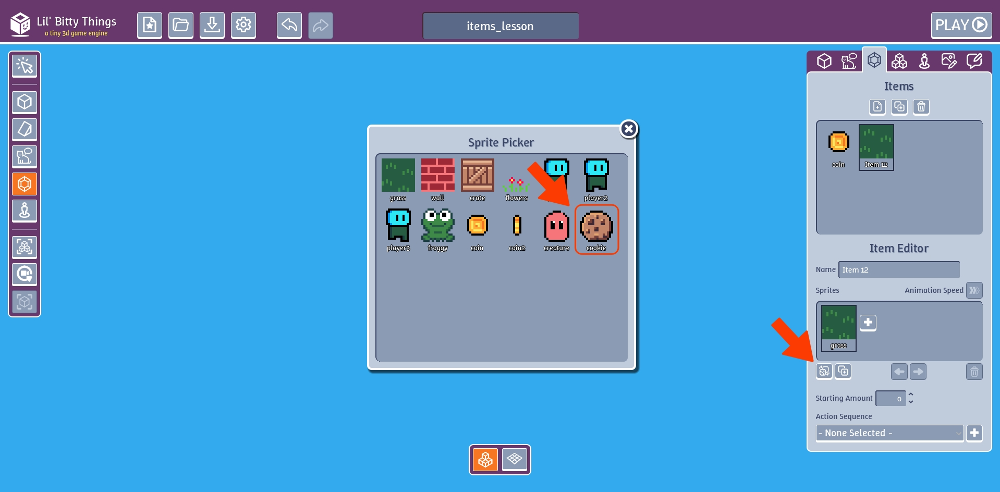

Name our Item "cookie".

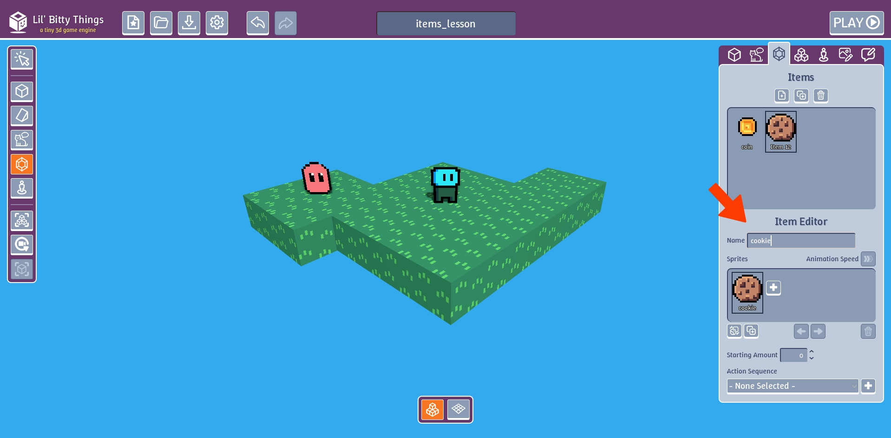

On the left tool bar, make sure you are in "Add Items" mode

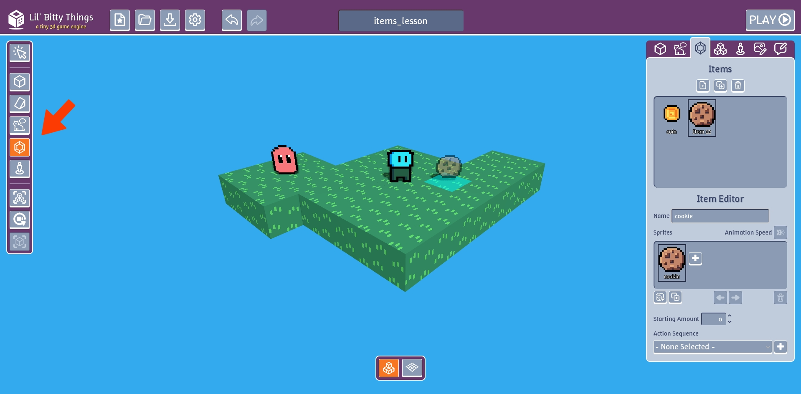

Place the food item on the right side of the room

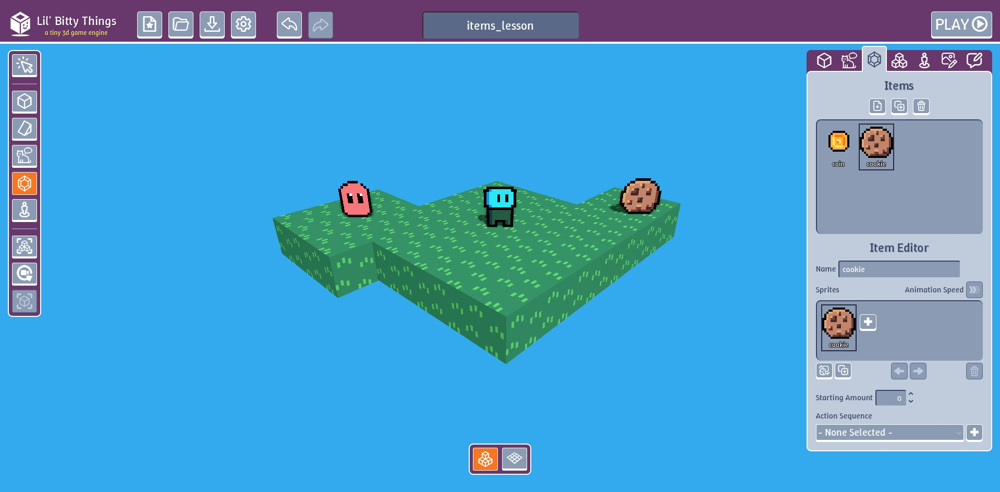

## Add Action Sequence to creature

In the "Action Sequence" tab, create new action and name it "Hungry".

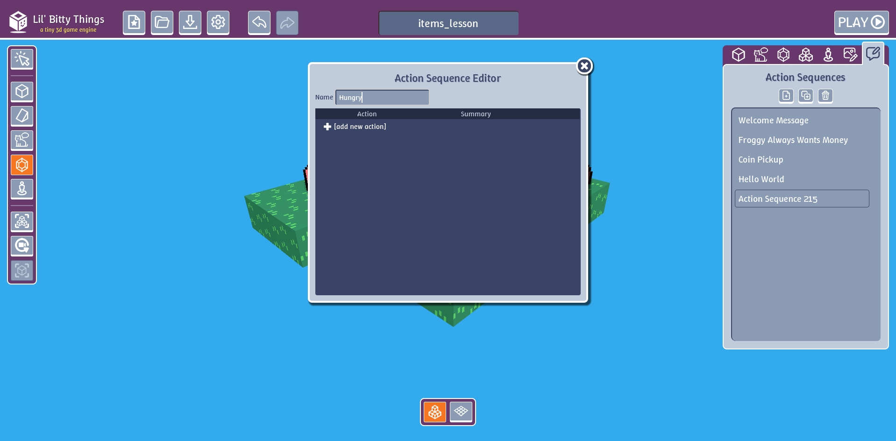

Click on the actions dropdown menu. Click on "Make a Decision" action.

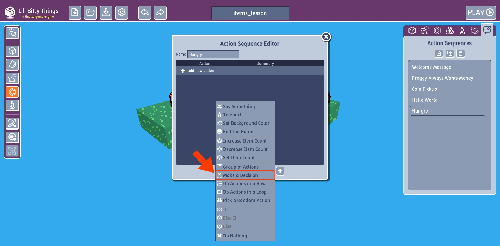

Click on the "If" inside the "Make a Decision" action. This is called an if condition.

**Condition:** is a state of being or a specific requirement.

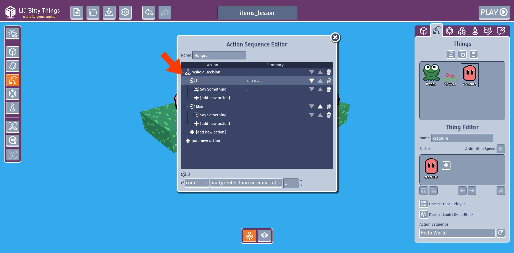

This will execute a different action depending on if some condition is true. For example, If cookies we have is more than 0. 

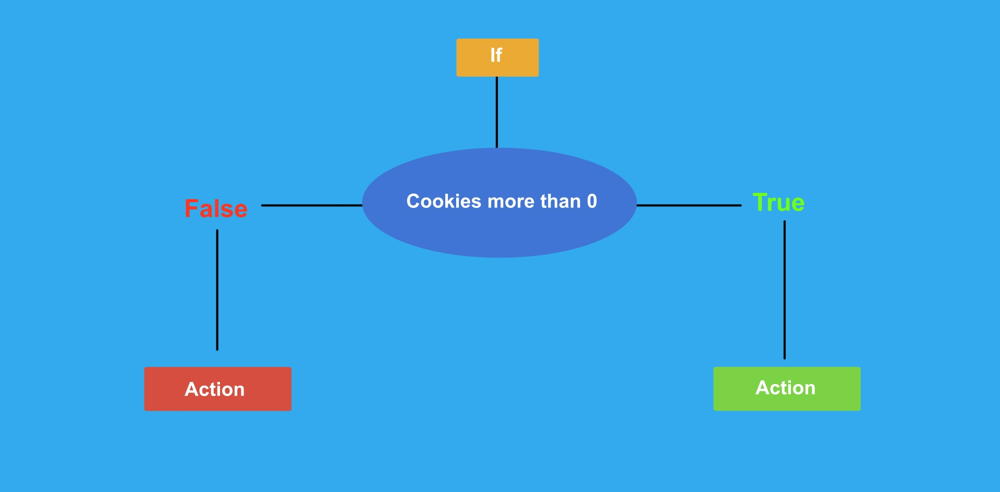

The bottom of the "Action Editor" is where we can chage our condition.

This is the dropdown button where we can choose any item we've created.

