We're going to practice using what we just learned to make lava that ends the game if the player touches it.

### Create lava Sprite

In the "Sprites" tab, create a new sprite and draw how you want the lava to look. I googled Minecraft textures and tried my best to mimic what I saw.

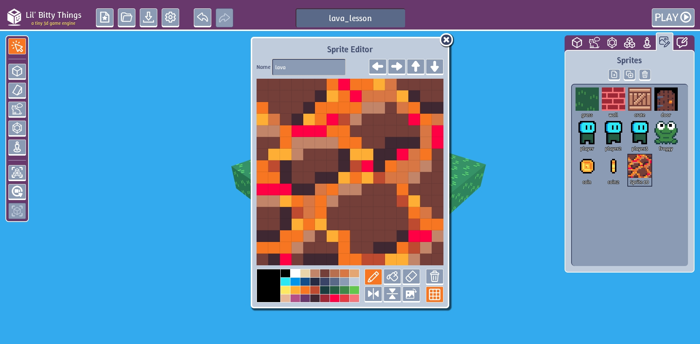

### Create lava Thing

Our object is going to need some interactivity so create a new Thing

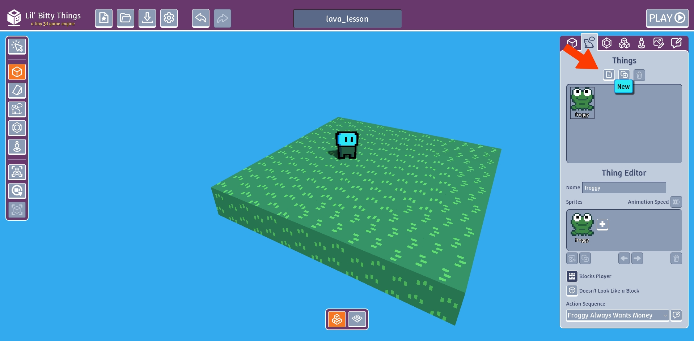

Swap sprite

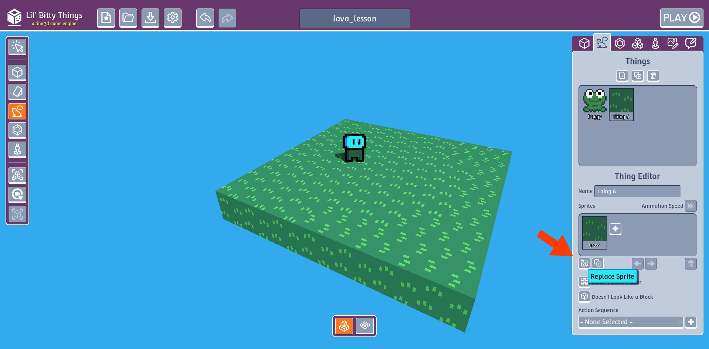

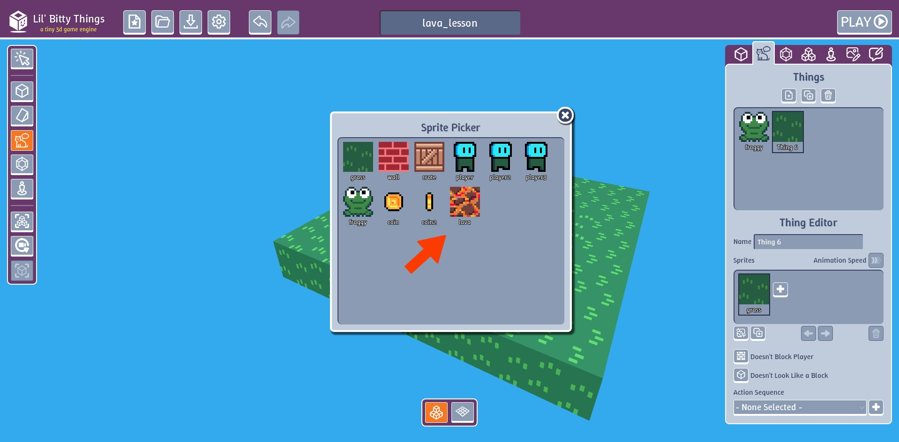

By default Things show up in the game as 2d images and not 3d blocks

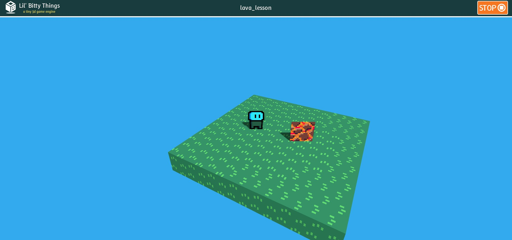

Click the "Looks Like a Block" toggle. In the editor, it will still look like an image, but in the game our lava will be a block. 

**Toggle:** means to switch back and forth between two or more options or states using a single button, key, or command.

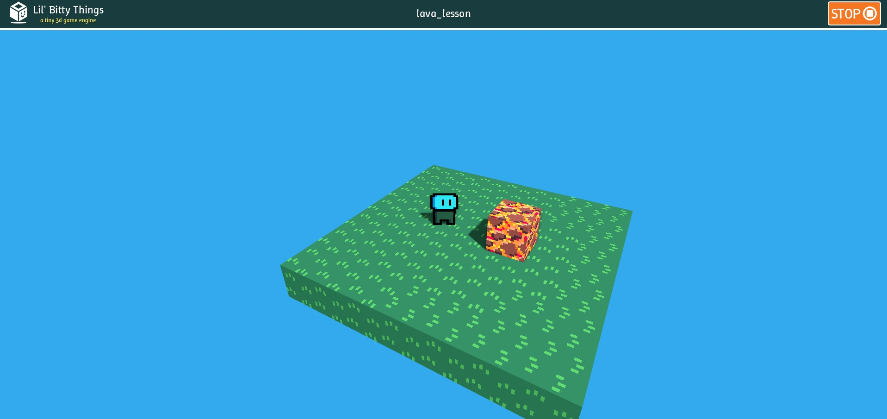

Rename our Thing "lava".

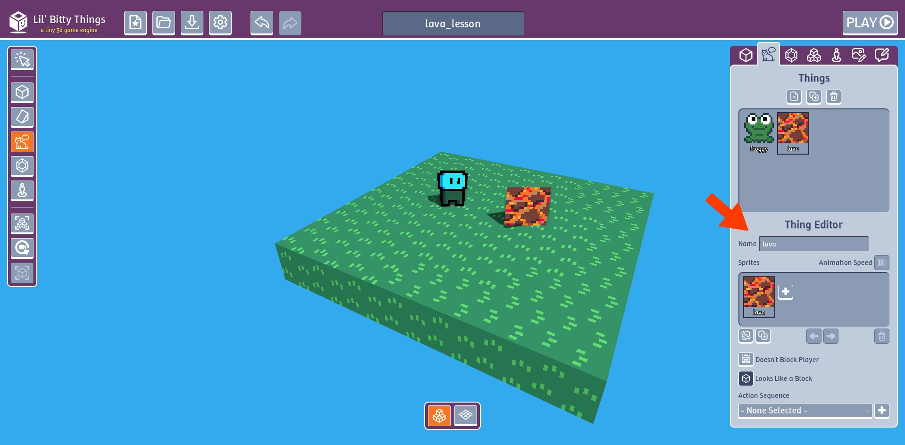

### Create End The Game action sequence

In the "Action Sequence" tab, create a new action sequence.

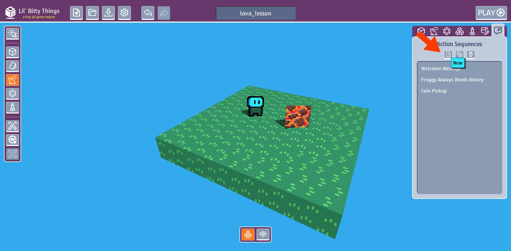

Add "End the Game" action

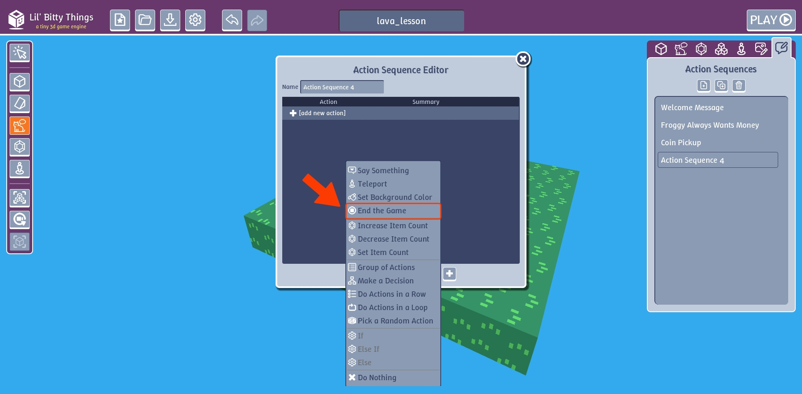

Add "Say Something" action

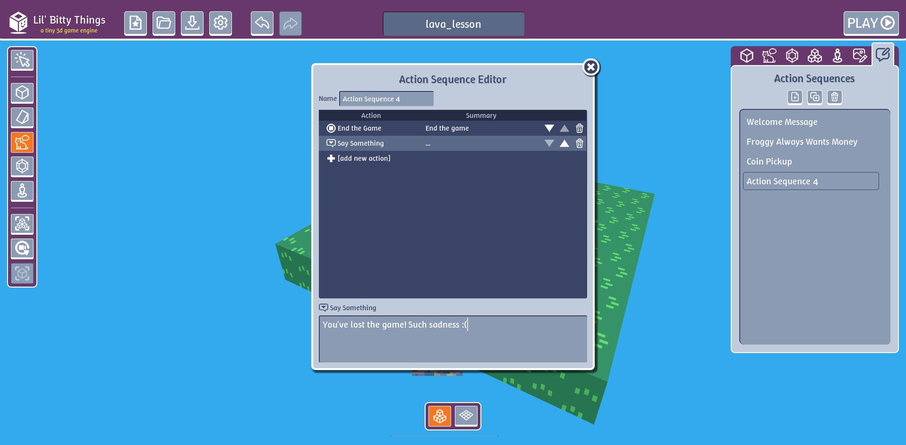

Click the up arrow on the "Say Something" action to change the order that the actions will be executed.
Otherwise the game will end first and our text will never show.

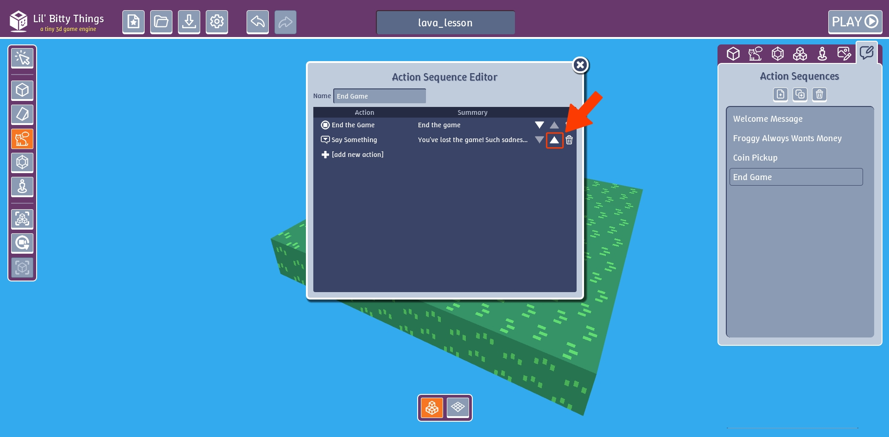

Rename our action "End Game".

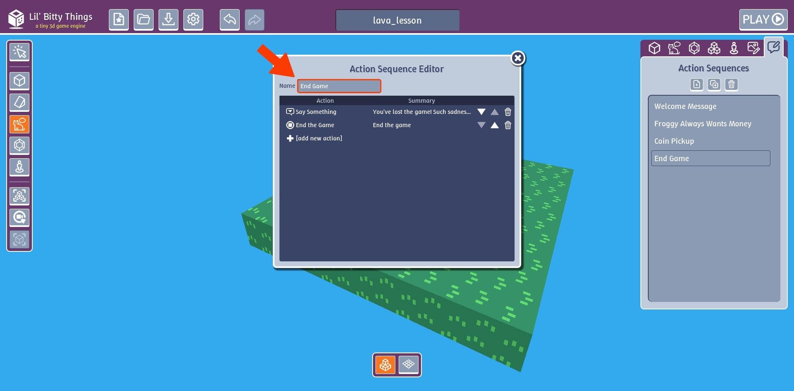

Add our new "Lava" action sequence to our Lava Thing.

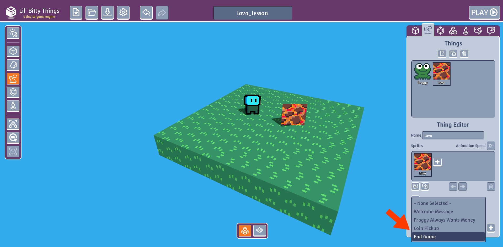

### Final result

Here's an example of the lava in my room.

