# What is the player?

The Player is the main star of the game. They can have different looks when walking or standing. The Player is always facing the camera. You can only have one Player in the game at a time.

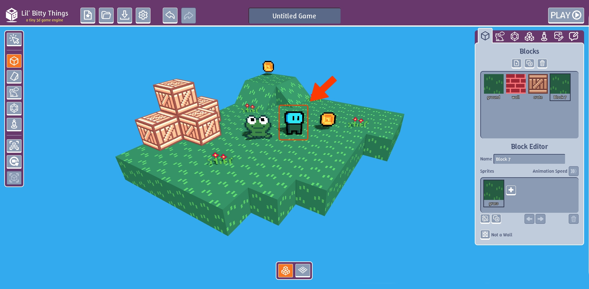

This is the player panel where you can edit how the player looks and change the animations.

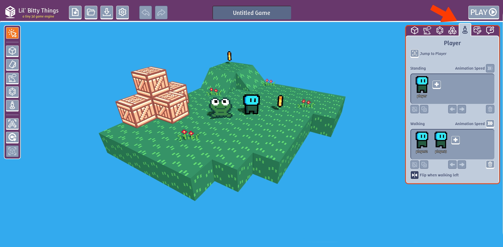

## How to change player sprite

First lets create a new sprite for the player. Go to the "Sprites" panel and click the new sprite button "+". Now click the "Clear" (trash can) button to delete all the pixel. 

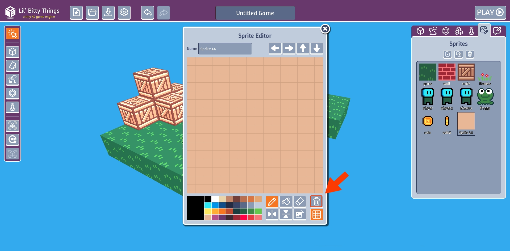

Draw a super cute cube.

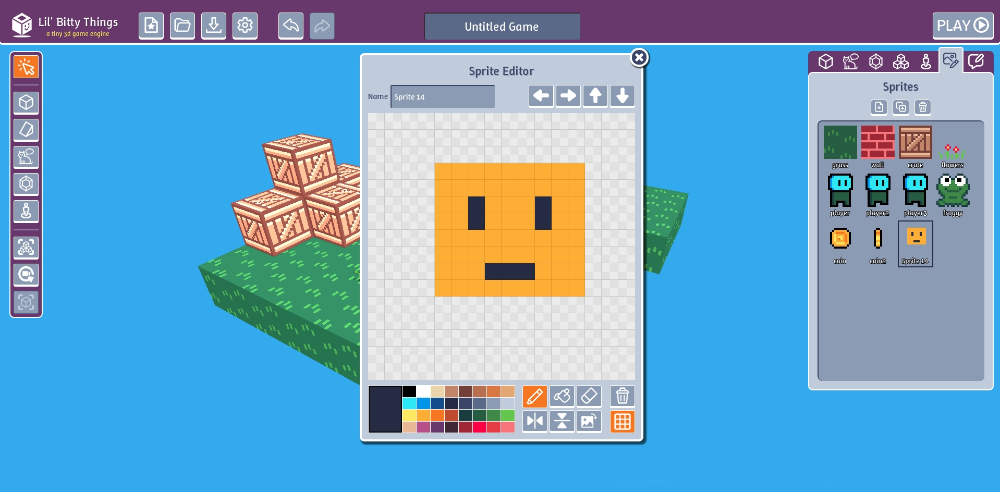

In the player panel, click "Replace Sprite" and select the new sprite we made.

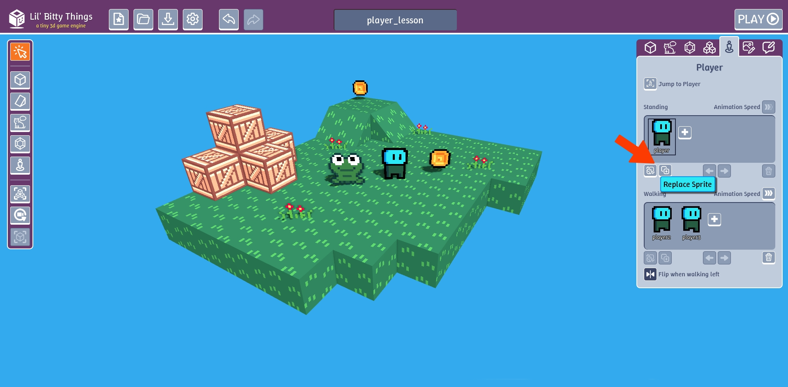

Now our player has changed!

## Add standing animation

If you look the "Standing" section in the player panel, you can see there is only 1 sprite. If we add a second sprite, 
the two sprites will play in a loop to create an animation. 

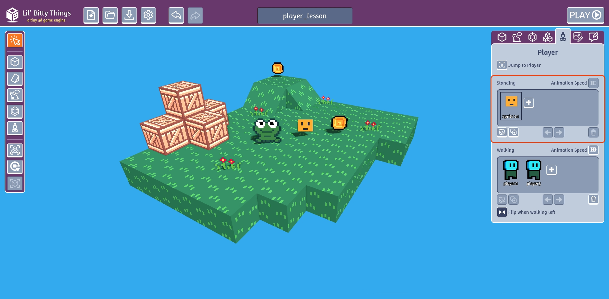

To see an example of this, go to the "Sprites" tab and duplicate the cube sprite we just made

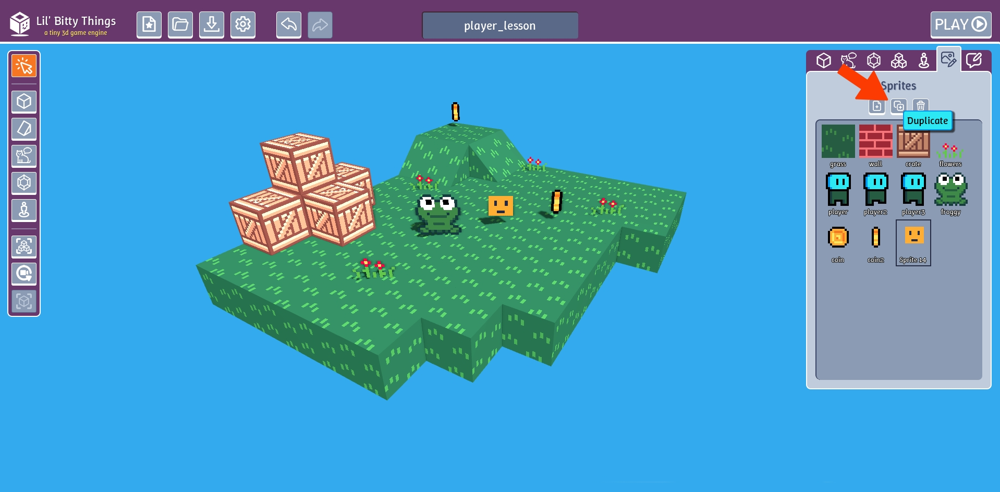

Edit the eyes so there are only 1 pixel instead of 2.

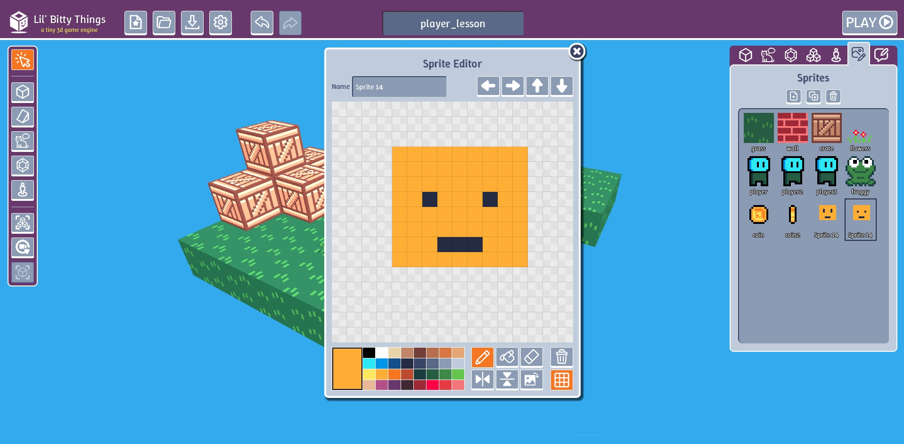

Let's rename this copy to "standing 2". This will help us stay organized.

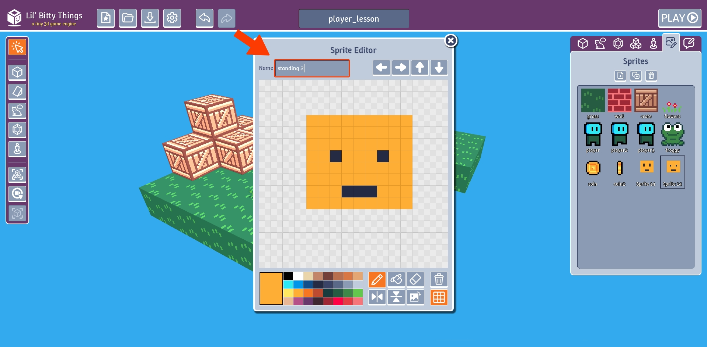

Also rename the orginal sprite we made to "standing 1"

Click the plus "+" button in the "Standing" section in "Player" tab.

Select the second sprite we made

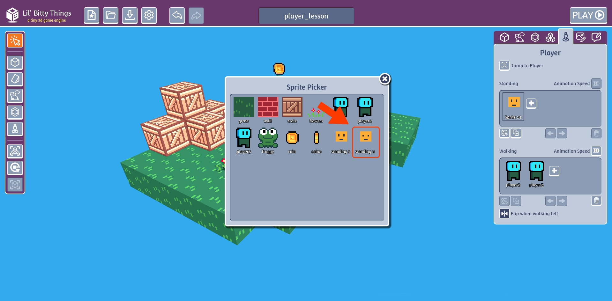

Now our cube player should be animating

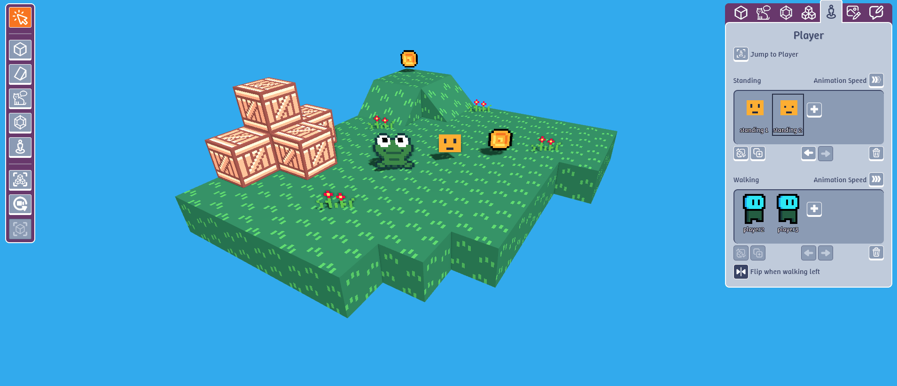

## Add walking animation

The "Walking" section lets us edit the walking animation. Notice we are still using
the same 2 sprites from the original anmimation. Try playing the game to see what happens
when we try to walk. 

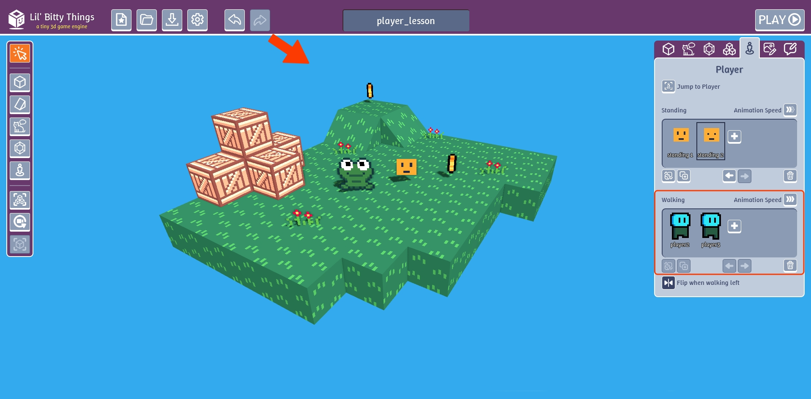

To fix this, we are going to make out own walking animation.

Go to the "Sprites" tab and duplicate the "standing 1" sprite. Name it "walking 1".
Draw a little leg on the left.

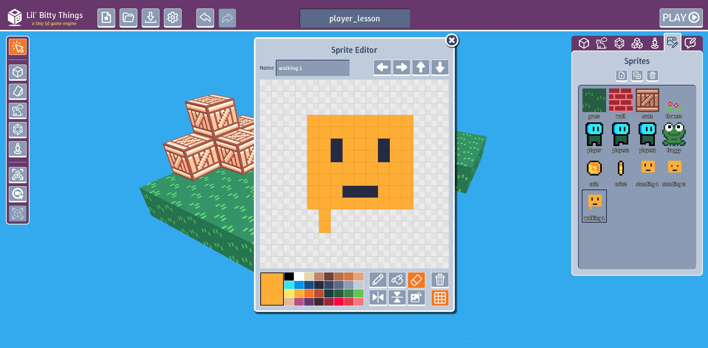

Duplicate "walking 1", edit it. Then duplicate "walking 2", edit it. Continue until
your have 4 sprites like below.

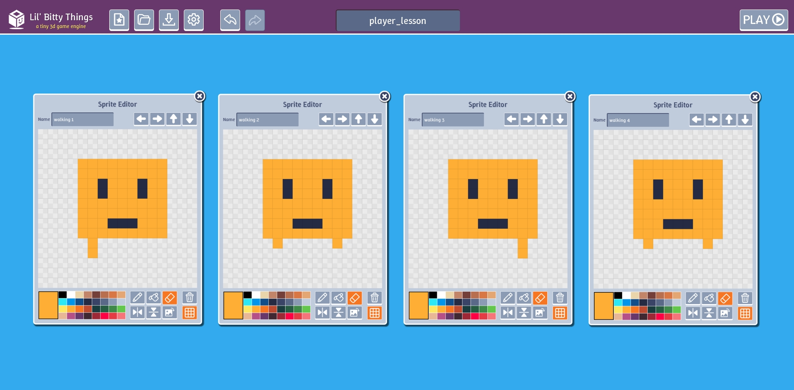

In the "Walking" section of the "Player" tab, delete or replace the old sprite and add
the 4 new sprites we made.

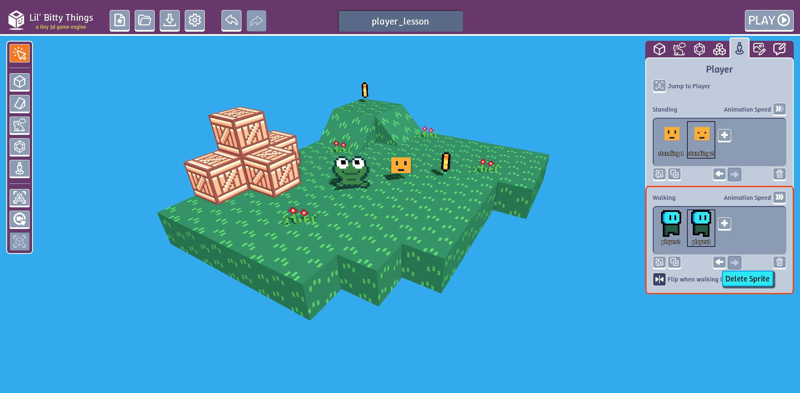

Now you have a walking animation.

