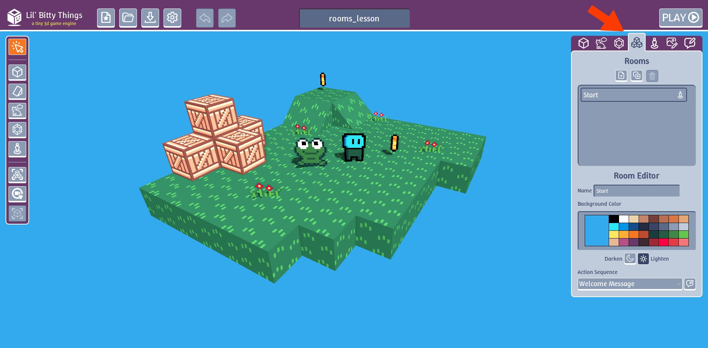
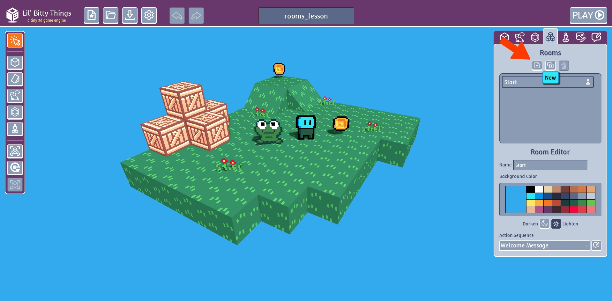
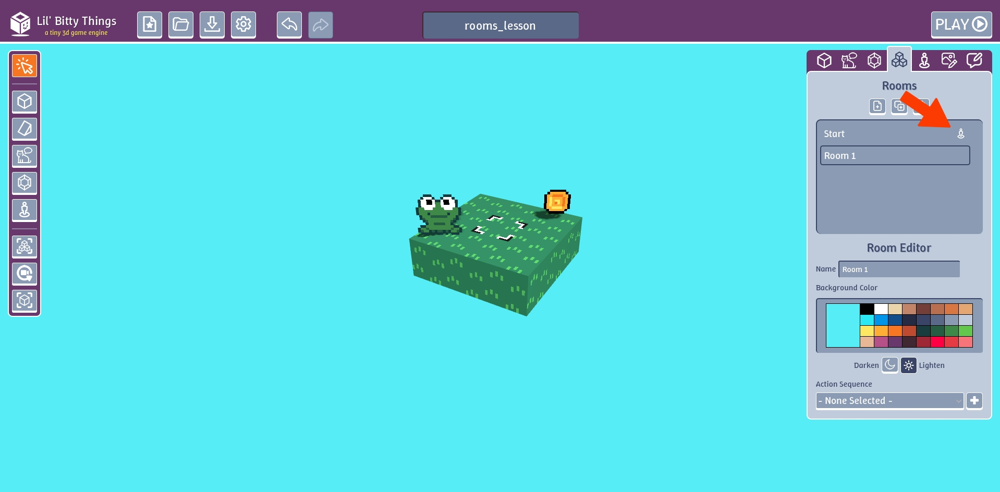
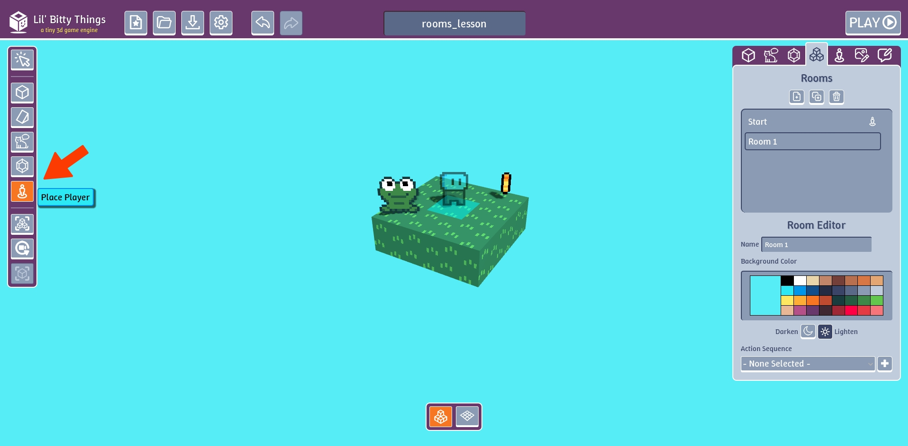
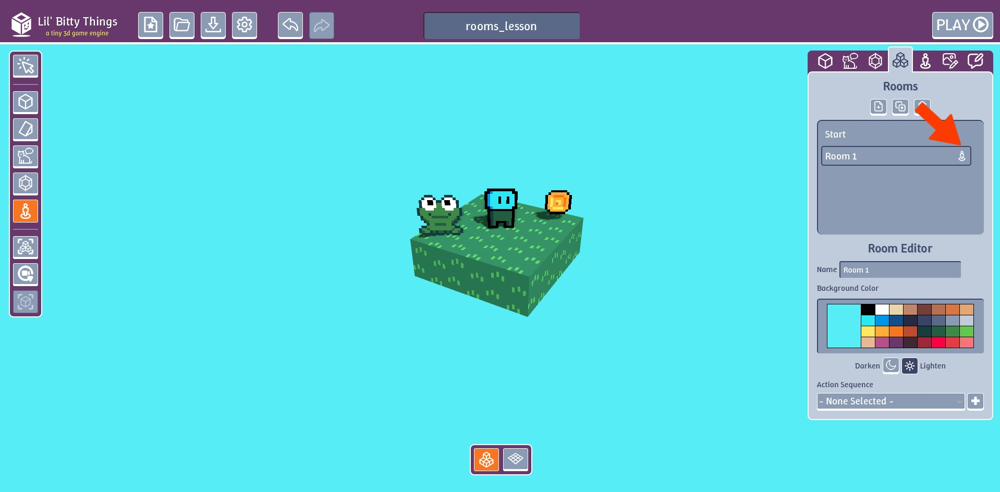
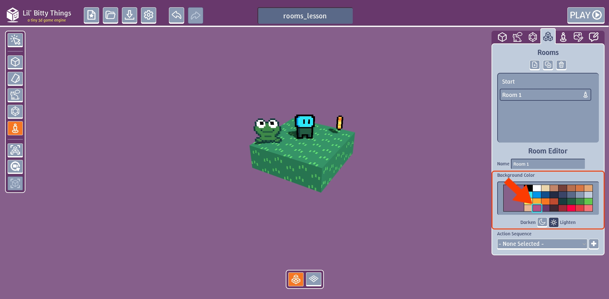
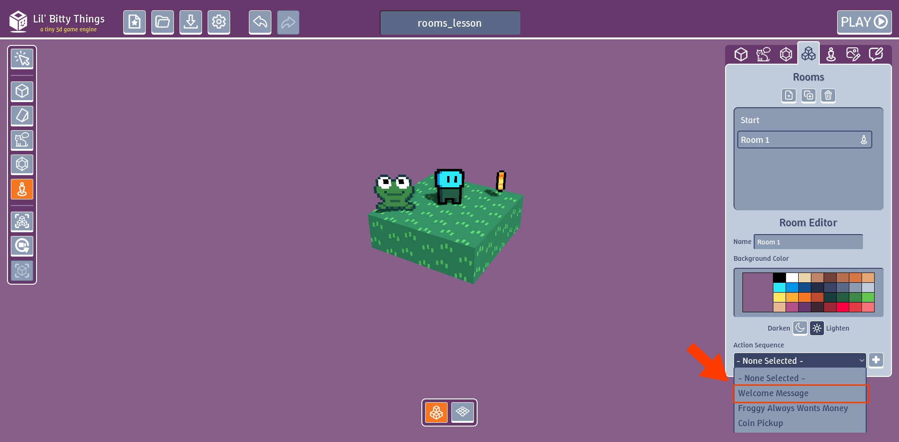
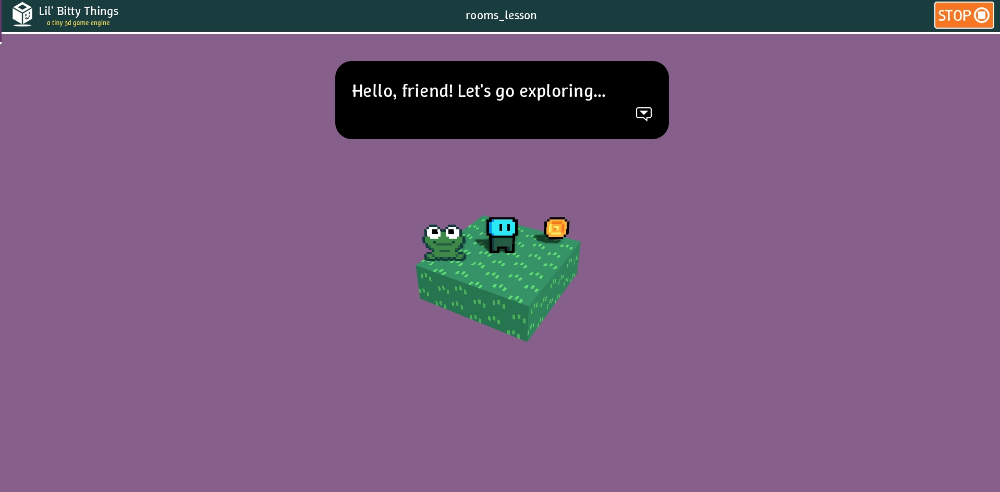

# What are Rooms?

Unlike Minecraft where the would is massive, Lil Bitty Things is made up rooms that you move between.

### How to create a room

Click on the "Rooms" tab

Click on "New" to create a new room

### Change player starting location

Right now there's no player on this level. This icon shows which room the player starts in when we start our game.

To make the player start in this room, click on the "Place Player" button on the left.

Click anywhere on the ground of the room. Notice how the player icon moved. Now you when play the game it should start on this room.

### Change background color

Personally this background color is making my eyes hurt. To change the color, pick one of the colors in the "Background Color"
section.

### Change starting message

You can add a starting message by going to click the drop down button in the "Action Sequence" section
and selecting "Welcome Message". This a premade action sequence that has a Say Something action that
displays "Hello, friend! Let's go exploring...".

This is what it looks like when you click "Play".

# What's next?

Great we have a second room. But how do we move between our rooms? Next we'll learn how to make doors