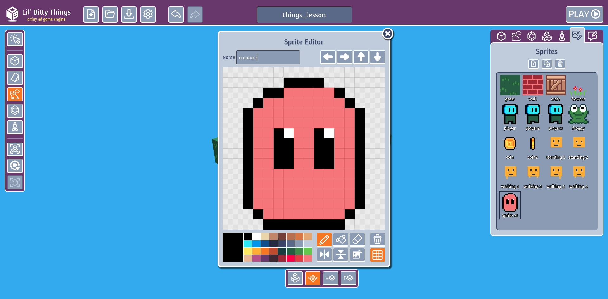
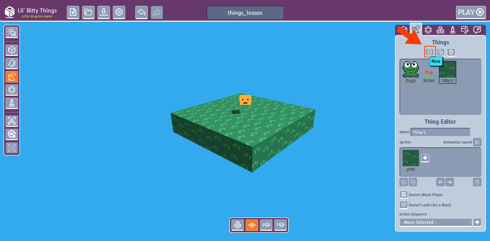
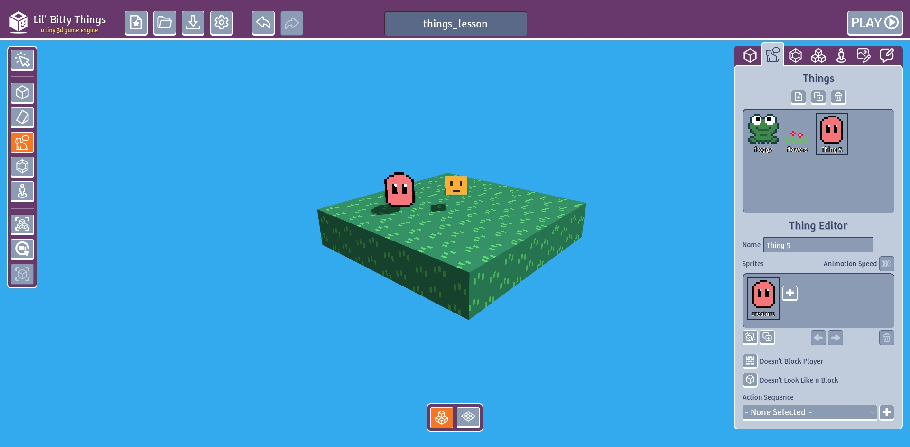
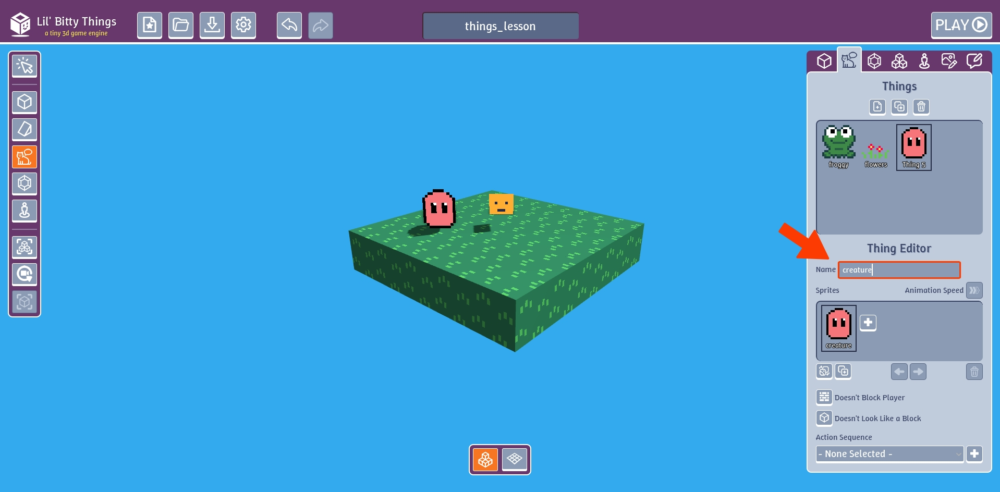

# What are things

What if you wanted to make a character you can talk to or make lava that is dangerous to touch?
That's what Things are for. Things are the main interactive part of your game.

### Create a new thing

Start by creating a new sprite and name is "creature".

Go to "Things" tab and click "New" button.

Replace the sprite by clicking the "Replace" button in the "Sprites" section of the "Things" tab

Place our new thing in our game

Name our thing "creature".

Now if you play your game you can see our new creature but when we touch or walk over it
nothing happens.

## What's next

We've created our thing but how do we write instructions on what should happen? That's where
action sequences come into the picture.