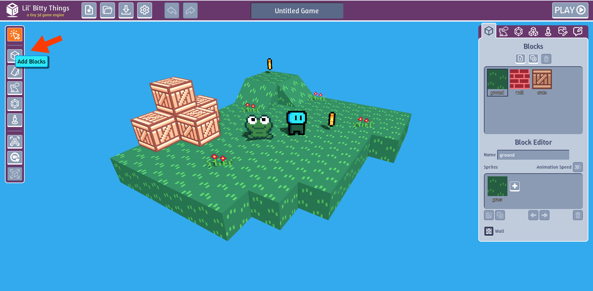
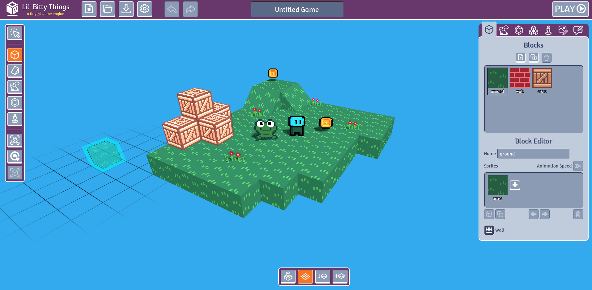
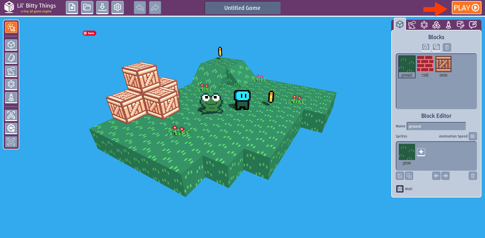
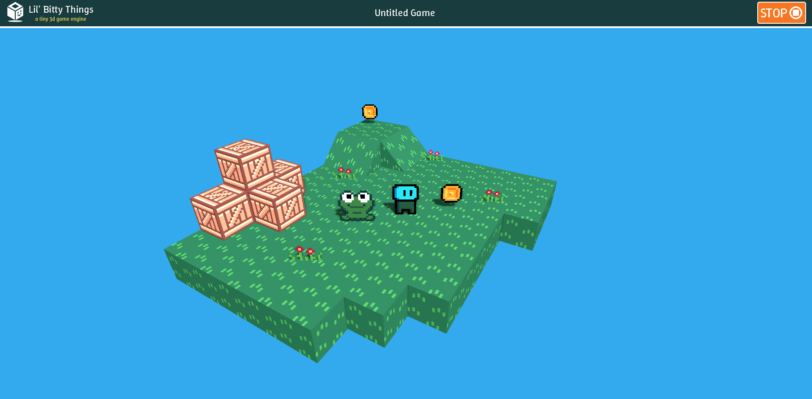
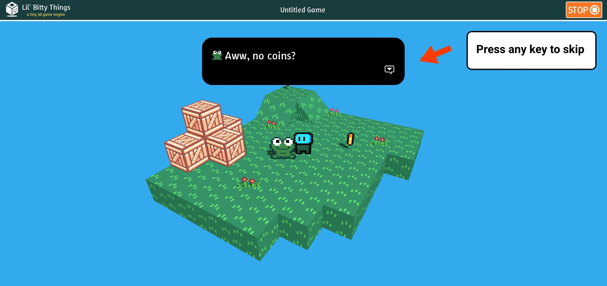

import { Image } from 'astro:assets';
import rKey from '../lessons/images/lesson-1/r-key.jpg';
import qKey from '../lessons/images/lesson-1/q-key.jpg';
import eKey from '../lessons/images/lesson-1/e-key.jpg';
import wasdKeys from '../lessons/images/lesson-1/wasd-keys.jpg';
import arrowKeys from '../lessons/images/lesson-1/arrow-keys.jpg';
import altKey from '../lessons/images/lesson-1/alt-key.jpg';
import shiftKey from '../lessons/images/lesson-1/shift-key.jpg';
import middleMouseIcon from '../lessons/images/lesson-1/middle-mouse-icon.png';
import rightMouseIcon from '../lessons/images/lesson-1/right-mouse-icon_128.jpg';
import leftMouseIcon from '../lessons/images/lesson-1/left-mouse-icon_128.jpg';
import scrollWheelIcon from '../lessons/images/lesson-1/scroll-wheel-icon.jpg';
import gridUpDownButtons from '../lessons/images/lesson-1/grid-up-down-buttons.png';
import createBlockImage from '../lessons/images/lesson-1/LBT-create-block.gif';

Let's start by learning how to move around.

## Rotate Camera

  <Image src={middleMouseIcon} height="50" alt="logo" />
  
    Use Use the Middle Mouse *or* ALT + Left Mouse button to rotate around the player

  <Image src={altKey} height="50" alt="logo" style="margin: 0;"/>
  +
  <Image src={leftMouseIcon} height="50" alt="logo" style="margin: 0;"/>
  
   ALT + Left Mouse button to rotate around the player

         

## Move Camera

  <Image src={shiftKey} height="50" alt="logo" style="margin: 0;"/>
  +
  <Image src={middleMouseIcon} height="50" alt="logo" style="margin: 0;"/>
  
   SHIFT + Middle Mouse

  <Image src={shiftKey} height="50" alt="logo" style="margin: 0;"/>
  +
  <Image src={altKey} height="50" alt="logo" style="margin: 0;"/>
  +
  <Image src={leftMouseIcon} height="50" alt="logo" style="margin: 0;"/>
  
    ALT + SHIFT + Left Mouse

         

## Zoom Camera In/Out

  <Image src={scrollWheelIcon} height="100" alt="logo" style="margin: 0;"/>
  
    Mouse Wheel or Two-Finger Scroll

         

## Block Editor

Blocks are what make up the world of your game. To add a block, click "Add Blocks" button on the left toolbar.

      

  <Image src={leftMouseIcon} height="50" alt="logo" style="margin: 0;"/>
  
    Hover mouse over where you want to place the block and left lick
  

      

  <Image src={rightMouseIcon} height="50" alt="logo" style="margin: 0;"/>
    
    To remove a block, hover over it and right click
    

         

### Create Slopes

On the left tool bar, click on *Add Slopes*. You can add/remove slopes the exact same way as blocks

   

  <Image src={rKey} height="50" alt="logo" style="margin: 0;"/>
    
    Press R to rotate
    

         

### Enabling Grid Placement

Right now in *Add Blocks* mode you can only add blocks that already in the game. In order to add block onto empty space, turn on grid mode.

To change the height of the grid the up and down buttons.

  <Image src={gridUpDownButtons} alt="logo" />

         

## Play Game

Click play button

     

  <Image src={wasdKeys} height="100" alt="logo" />
  
    To move around use WASD
  

  <Image src={arrowKeys} height="100" alt="logo" />
  
    **or** arrow keys
  

  
    Rotate camera with Q 
  
  <Image src={qKey} height="50" alt="logo" />
  
    **or** E
  
  <Image src={eKey} height="50" alt="logo" />
  
    keys
  

Continue through dialogue press any key

